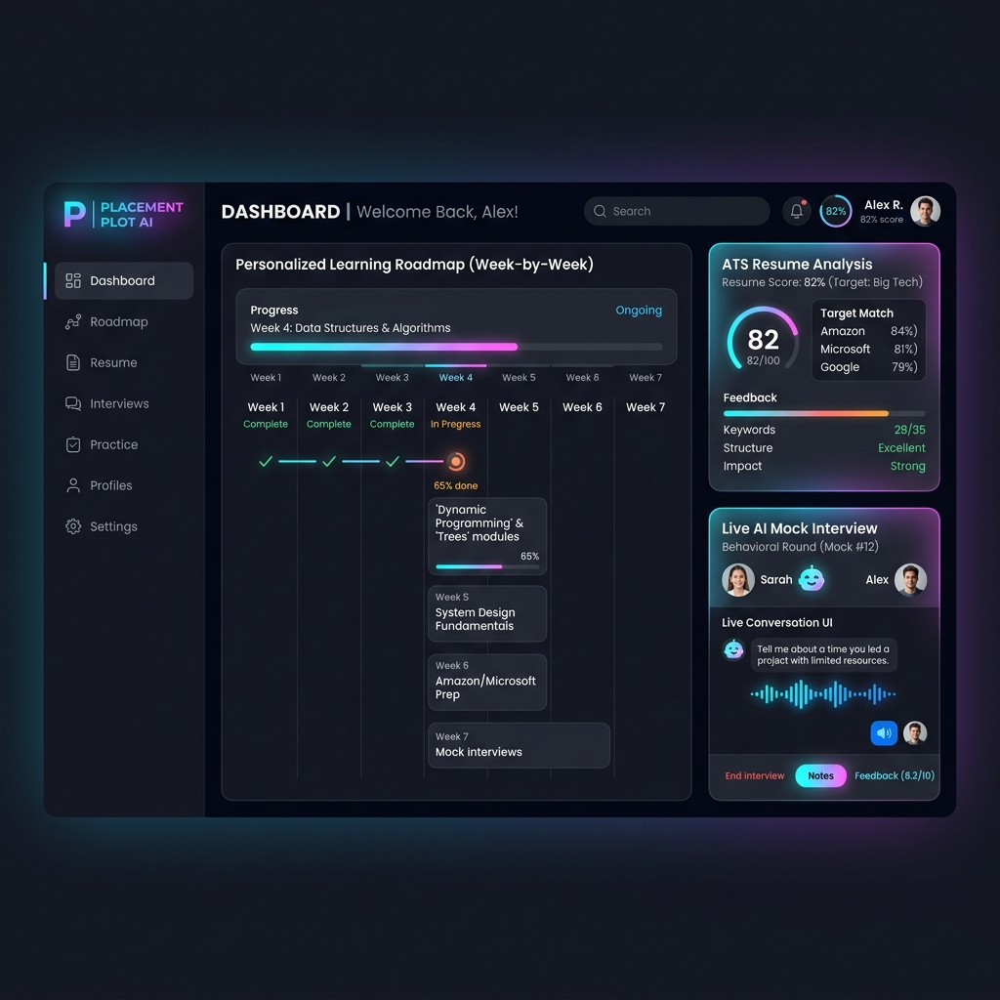
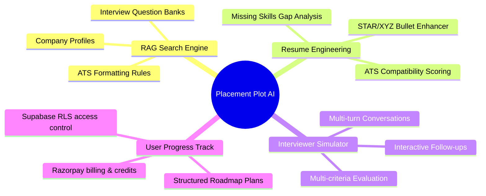
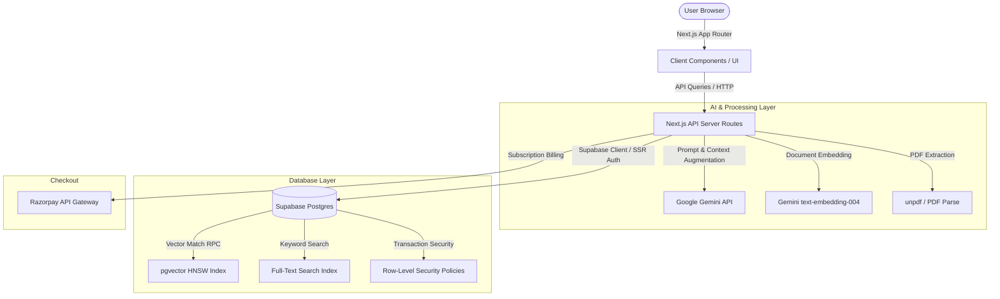
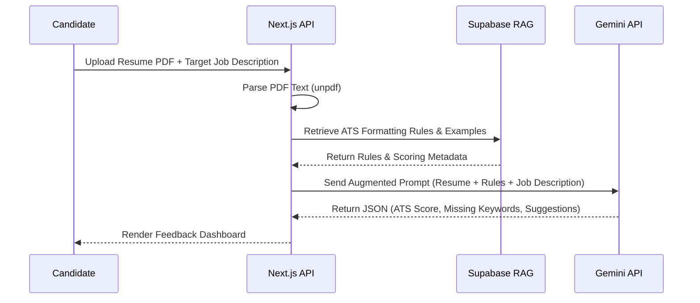
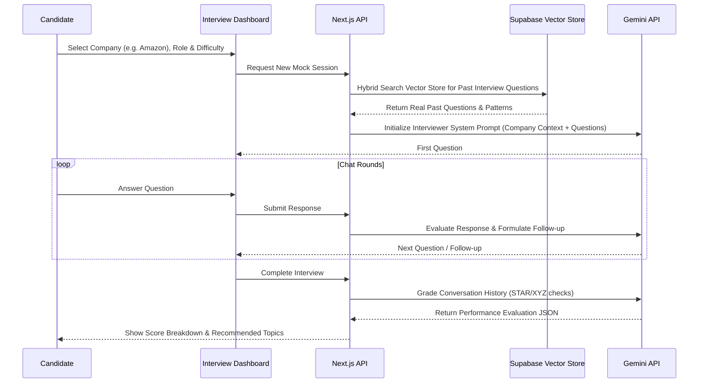

# 🧠 Placement Plot AI
### RAG-Powered Intelligent Placement Preparation & AI Mock Interview System
## Getting Started
<p align="center">


</p>
First, run the development server:
---
# 🚀 Executive Summary
Placement Plot AI is an enterprise-grade AI-powered SaaS career portal designed to optimize placement preparation for engineering candidates. By combining Next.js, Supabase (PostgreSQL), and Google Gemini API, the system analyzes resumes, detects specific skill gaps against target company profiles, generates week-by-week personalized learning ro
---
# 🌟 Product Demo & Interface Mockup
Below is a conceptual layout of the Placement Plot AI dashboard, demonstrating the unified workspace, candidate analytics, interactive roadmaps, and the mock interview suite:
<p align="center">
  
</p>
---
# 🌟 Key Highlights
- ✅ Next.js & Supabase Architecture: Modern App Router layout with server-side rendering (SSR) and strict Postgres Row-Level Security (RLS).
- ✅ Hybrid RAG Engine: Fuses vector cosine similarity metrics (using Gemini `text-embedding-004`) with keyword indexes (`tsvector`/`ts_rank`).
- ✅ Automated ATS Scoring: Extracts candidate text (via `unpdf`) to score compatibility and map keyword gaps against specific job requirements.
- ✅ AI Interactivity & Dynamic Prompts: Implements multi-turn mock interview agents that dynamically adjust follow-up lines based on candidate responses.
- ✅ Payment System Integration: Processes secure payments and subscriptions via Razorpay, directly updating client resource credits.
- ✅ Structured JSON Outputs: Employs schema validation rules to format raw LLM text into verified JSON objects for dashboard parsing.
---
# 🎯 Problem Statement
Traditional placement preparation systems are fragmented and present key challenges:
- One-Size-Fits-All Advice: Students prepare using generic resources rather than targeted material matched to specific companies (e.g., Google vs. McKinsey).
- Expensive Coaching: Getting professional resume reviews and realistic mock interviews is costly and non-scalable.
- Unquantified Progress: Candidates struggle to evaluate formatting, find missing keywords, and track week-by-week progress metrics.
- Data Silos: Placement preparation platforms rarely integrate learning materials, resumes, payments, and mock feedback in a single hub.
---
# 🧩 Problem Landscape

---
# 🏗️ Enterprise System Architecture

---
# 🔄 End-to-End Workflow
### 1. Resume Assessment & Skill Gap Engine

### 2. Interactive Mock Interview Simulation

---
# 📂 Database Schema Overview
The database is built on PostgreSQL inside Supabase, utilizing `pgvector` for fast approximate nearest neighbor (ANN) similarity matching.
### Database Tables
| Table | Primary Key | Description | RLS Policy |
|---|---|---|---|
| `documents` | `UUID` | Unified knowledge base storing vector embeddings (768D) for ATS rules, company profiles, and learning resources. | Public Read |
| `profiles` | `UUID` (auth.users) | Extended user profile details (college, tier, resume/interview credits). | Owner Read/Write |
| `resumes` | `UUID` | Stores parsed resume text, ATS scoring JSONs, and PDF paths. | Owner Read/Write |
| `mock_interviews`| `UUID` | Logs full chat history transcripts, category scores, and final feedback. | Owner Read/Write |
| `roadmap_plans` | `UUID` | Personalized study modules, week-by-week tasks, and completion progress. | Owner Read/Write |
| `subscriptions` | `UUID` | Syncs Razorpay subscription plans, status, and renewal deadlines. | Owner Read/Write |
---
# 🧮 Hybrid Search & Vector RAG Engine
A custom PostgreSQL stored function `match_documents` fusions semantic vector distance and text ranking using a weighted score
```sql
CREATE OR REPLACE FUNCTION match_documents(
  query_embedding VECTOR(768),
  query_text TEXT,
  filter_kb_type TEXT,
  filter_metadata JSONB DEFAULT '{}',
  match_count INT DEFAULT 5,
  vector_weight FLOAT DEFAULT 0.7,
  text_weight FLOAT DEFAULT 0.3
)
RETURNS TABLE (id UUID, content TEXT, metadata JSONB, similarity FLOAT)
AS $$
BEGIN
  RETURN QUERY
  WITH vector_results AS (
    SELECT d.id, d.content, d.metadata, 1 - (d.embedding <=> query_embedding) AS vec_similarity
    FROM documents d
    WHERE d.kb_type = filter_kb_type
      AND (filter_metadata = '{}'::JSONB OR d.metadata @> filter_metadata)
    ORDER BY d.embedding <=> query_embedding LIMIT match_count * 2
  ),
  text_results AS (
    SELECT d.id, d.content, d.metadata, ts_rank(d.fts, plainto_tsquery('english', query_text)) AS text_rank
    FROM documents d
    WHERE d.kb_type = filter_kb_type
      AND d.fts @@ plainto_tsquery('english', query_text)
    ORDER BY text_rank DESC LIMIT match_count * 2
  )
  SELECT 
    COALESCE(v.id, t.id) AS id,
    COALESCE(v.content, t.content) AS content,
    COALESCE(v.metadata, t.metadata) AS metadata,
    (COALESCE(v.vec_similarity, 0) * vector_weight + COALESCE(t.text_rank, 0) * text_weight) AS similarity
  FROM vector_results v
  FULL OUTER JOIN text_results t ON v.id = t.id
  ORDER BY similarity DESC LIMIT match_count;
END;
$$ LANGUAGE plpgsql;
```
---
# 🛠️ Technology Stack
| Layer | Technology | Description |
|---|---|---|
| Frontend | React 19, Next.js (App Router), Tailwind CSS v4, Lucide React | Clean, high-performance visual dashboard styling. |
| Backend | Next.js Server Actions & API Routes, Node.js | Fast serverless routing and server component rendering. |
| Database | Supabase, PostgreSQL | Secure Relational Database with real-time replication. |
| AI/ML Layer| Google Gemini API (`text-embedding-004`), JSON constraints | Vector embeddings and structured generative evaluations. |
| Extensions | pgvector (HNSW Index), GIN (jsonb_path_ops) | High-speed semantic similarity queries and JSON search. |
| Payments | Razorpay Node SDK | Subscription billing webhook handler and credits updates. |
| Utilities | unpdf, jsonrepair, uuid | Clean document extraction and reliable JSON parser fixes. |
---
# 📁 Project Directory Tree
```bash
npm run dev
# or
yarn dev
# or
pnpm dev
# or
bun dev
placementplot/
├── public/                 # Static assets (icons, SVGs, screenshots)
│   └── dashboard-screenshot.png
├── supabase/
│   └── migrations/         # PostgreSQL table migrations & RPCs
│       └── 001_vector_tables.sql
├── src/
│   ├── app/                # Next.js App Router folders & pages
│   │   ├── api/            # API Route handlers (Auth, Seed, AI APIs)
│   │   └── (dashboard)/    # Dashboard portal layout & views
│   ├── features/           # Modularized platform features
│   │   ├── interview/      # Mock interview state & prompts
│   │   ├── payment/        # Razorpay transactions
│   │   ├── resume/         # ATS parsing, scoring, & STAR metrics
│   │   └── roadmap/        # Placement learning roadmap rules
│   ├── lib/                # Shared logic engines (RAG, Gemini, Supabase)
│   │   ├── chunker.ts
│   │   ├── embeddings.ts
│   │   ├── rag.ts
│   │   └── supabase.ts
│   └── utils/
├── package.json
└── tsconfig.json
```
Open [http://localhost:3000](http://localhost:3000) with your browser to see the result.
---
You can start editing the page by modifying `app/page.tsx`. The page auto-updates as you edit the file.
# ⚙️ Installation & Setup
This project uses [`next/font`](https://nextjs.org/docs/app/building-your-application/optimizing/fonts) to automatically optimize and load [Geist](https://vercel.com/font), a new font family for Vercel.
Follow these steps to configure your environment and boot up the project:
## Learn More
### 1. Clone & Install Dependencies
```bash
git clone https://github.com/yourusername/placementplot.git
cd placementplot
npm install
```
To learn more about Next.js, take a look at the following resources:
### 2. Configure Environment Variables
Create a `.env.local` file in the root directory:
```env
NEXT_PUBLIC_SUPABASE_URL=your_supabase_project_url
NEXT_PUBLIC_SUPABASE_ANON_KEY=your_supabase_anon_public_key
SUPABASE_SERVICE_ROLE_KEY=your_supabase_service_role_secret
GEMINI_API_KEY=your_google_gemini_api_key
RAZORPAY_KEY_ID=your_razorpay_key_id
RAZORPAY_KEY_SECRET=your_razorpay_key_secret
```
- [Next.js Documentation](https://nextjs.org/docs) - learn about Next.js features and API.
- [Learn Next.js](https://nextjs.org/learn) - an interactive Next.js tutorial.
### 3. Setup Database Schema
1. Connect to your **Supabase SQL Editor**.
2. Copy and execute the migrations script located in `supabase/migrations/001_vector_tables.sql` to initialize tables, indexes, and custom RPC functions.
3. Boot up the development server:
   ```bash
   npm run dev
   ```
4. Run the seed script in a separate window to pre-populate the vector database with company profiles and resume examples:
   ```bash
   node setup-db.mjs
   ```
You can check out [the Next.js GitHub repository](https://github.com/vercel/next.js) - your feedback and contributions are welcome!
---
## Deploy on Vercel
# 🏆 Core Learning Demonstrations
The easiest way to deploy your Next.js app is to use the [Vercel Platform](https://vercel.com/new?utm_medium=default-template&filter=next.js&utm_source=create-next-app&utm_campaign=create-next-app-readme) from the creators of Next.js.
Building this project exercises key systems engineering competencies:
- **Vector Search Optimization:** Creating index files (HNSW and GIN) for performance indexing of complex embeddings.
- **Context Window Management:** Tuning hybrid RAG weights and source-citing boundaries inside system prompts.
- **Secure Transaction Handling:** Linking external APIs (Razorpay) to state updates behind RLS policy gates.
- **Structured LLM Orchestration:** Forcing schema formatting constraints (`jsonrepair` integration) to avoid raw text-parsing crashes.
Check out our [Next.js deployment documentation](https://nextjs.org/docs/app/building-your-application/deploying) for more details.
---
<div align="center">
### ⭐ If this platform helped you land your placement, please give it a star!
</div>
