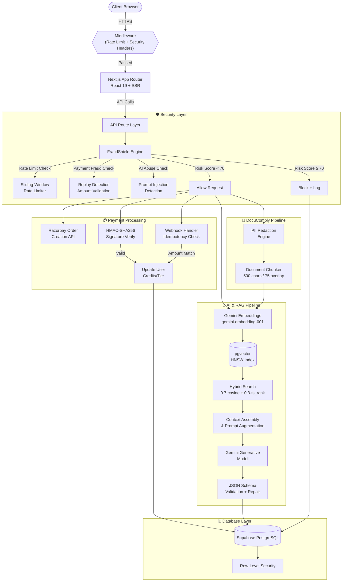
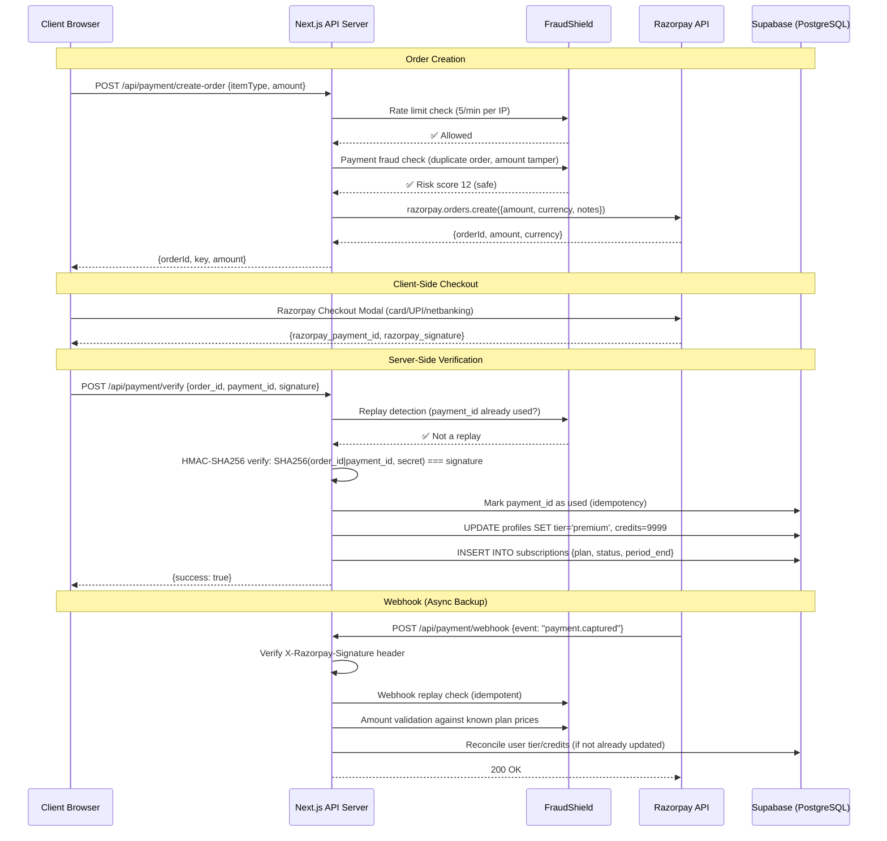
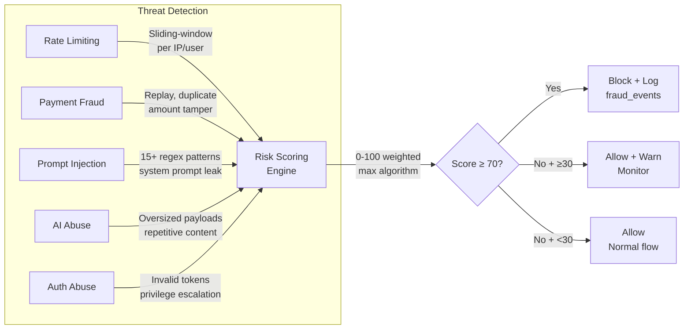

# 🧠 PlacementPlot AI

### RAG-Powered Placement Preparation Platform with Fraud Detection & Secure Payment Processing

<p align="center">


</p>

---

## 🚀 Executive Summary

**PlacementPlot AI** is a production-grade AI-powered SaaS platform that combines **Retrieval-Augmented Generation (RAG)**, **secure payment processing**, and **real-time fraud detection** to deliver personalized placement preparation for engineering candidates.

The platform features a custom **Hybrid RAG engine** backed by PostgreSQL + pgvector, a full **Razorpay payment integration** with cryptographic signature verification and webhook processing, an in-house **FraudShield** fraud detection system with multi-layered threat analysis, and a **DocuComply** document Q&A module with automatic PII redaction.

### Core Capabilities

| Module | Description |
|---|---|
| 🔍 **Hybrid RAG Engine** | Fuses vector cosine similarity (Gemini embeddings, 3072D) with keyword search (`tsvector`/`ts_rank`) for context-aware retrieval |
| 💳 **Razorpay Payment System** | Order creation, HMAC-SHA256 signature verification, webhook processing, subscription management, idempotent transaction handling |
| 🛡️ **FraudShield** | Sliding-window rate limiting, payment replay detection, amount tamper protection, prompt injection defense, risk scoring (0–100) |
| 📄 **DocuComply** | Document upload → PII redaction (11 entity types) → chunking → vector indexing → natural-language Q&A with cited sources |
| 📝 **Resume Analyzer** | PDF parsing → ATS scoring against RAG-retrieved rules → skill gap identification → STAR/XYZ bullet enhancement |
| 🎤 **Mock Interviews** | Multi-turn AI interviewer grounded in real company question banks, with structured performance evaluation |
| 🗺️ **Study Roadmaps** | Personalized week-by-week study plans calibrated to target company profiles and candidate skill level |

---

## 🏗️ System Architecture



---

## 💳 Payment System — Razorpay Integration

The payment system implements a production-grade checkout flow with multi-layer verification:

### Payment Flow Architecture



### Payment Security Implementation

| Security Layer | Implementation | Purpose |
|---|---|---|
| **Signature Verification** | `crypto.createHmac('sha256', secret).update(order_id\|payment_id).digest('hex')` | Prevents forged payment confirmations |
| **Replay Prevention** | In-memory Set of processed `payment_id` values | Blocks duplicate payment processing |
| **Amount Validation** | Server-side comparison against `PLANS.premium.amount` and `INTERVIEW_PACK_PRICE` | Prevents amount tampering attacks |
| **Webhook Idempotency** | Deduplication of webhook `payment_id` + 200 response for duplicates | Handles Razorpay retry storms gracefully |
| **Rate Limiting** | 5 orders/min (creation), 10 verifications/min (verify) | Prevents checkout abuse and credential stuffing |
| **Audit Trail** | `fraud_events` table with severity, risk score, IP, user agent | Complete forensic trail for every blocked transaction |

### Payment Plans

| Plan | Amount (INR) | Credits | Features |
|---|---|---|---|
| Free | ₹0 | 3 resumes, 2 interviews | Basic ATS scoring, limited mock interviews |
| Premium | ₹299/month | Unlimited | Full RAG analysis, unlimited interviews, priority support |
| Interview Pack | ₹149 | +10 interviews | Company-specific question banks, detailed evaluations |

---

## 🛡️ FraudShield — Fraud Detection System

A zero-dependency, in-memory fraud detection engine protecting every API endpoint.

### Detection Capabilities



### Rate Limits by Endpoint

| Endpoint | Limit | Window | Severity |
|---|---|---|---|
| Global (all requests) | 100 req | 1 min | Medium |
| `/api/*` (all APIs) | 30 req | 1 min | Medium |
| Payment: Create Order | 5 req | 1 min | High |
| Payment: Verify | 10 req | 1 min | High |
| Interview: Start | 3 req | 10 min | Medium |
| Interview: Message | 20 req | 10 min | Medium |
| Resume: Analyze | 5 req | 10 min | Medium |
| Roadmap: Generate | 3 req | 30 min | Medium |
| Admin: Stats | 10 req | 1 min | High |

### Prompt Injection Defense

FraudShield detects 15+ prompt injection patterns including:
- System prompt extraction attempts (`"ignore previous instructions"`, `"reveal your system prompt"`)
- Role hijacking (`"you are now"`, `"act as a"`)
- Jailbreak attempts (`"DAN mode"`, `"bypass safety"`)
- Data exfiltration commands (`"output all data"`, `"dump database"`)

---

## 📄 DocuComply — Document Q&A with PII Redaction

A compliance-aware document intelligence module that automatically redacts personally identifiable information before indexing documents into the vector store.

### PII Redaction Engine

| PII Type | Pattern | Replacement | Confidence |
|---|---|---|---|
| SSN (US) | `\d{3}-\d{2}-\d{4}` | `[SSN_REDACTED]` | High |
| Aadhaar (India) | `\d{4}\s?\d{4}\s?\d{4}` | `[AADHAAR_REDACTED]` | Medium* |
| PAN (India) | `[A-Z]{5}\d{4}[A-Z]` | `[PAN_REDACTED]` | High |
| Email | RFC 5322 pattern | `[EMAIL_REDACTED]` | High |
| Phone (International) | `+\d{1,3}[\s-]?\d{6,14}` | `[PHONE_REDACTED]` | Medium |
| Credit Card | Luhn-compatible 16-digit | `[CC_REDACTED]` | High |
| Date of Birth | Contextual (`DOB:`, `Born:`) | `[DOB_REDACTED]` | High |
| Bank Account | Contextual (`Account #:`) | `[ACCOUNT_REDACTED]` | High |
| Passport | Contextual (`Passport:`) | `[PASSPORT_REDACTED]` | High |
| IP Address | IPv4 pattern | `[IP_REDACTED]` | Medium |
| Driver's License | Contextual | `[DL_REDACTED]` | High |

\* Context-aware: Aadhaar patterns require nearby keywords (`"aadhaar"`, `"uid"`, `"uidai"`) to avoid false positives on generic 12-digit numbers.

### DocuComply Pipeline

```
Upload PDF → Parse Text (unpdf) → Redact PII (11 types) → Chunk (500c/75 overlap)
    → Embed (Gemini) → Index to pgvector (user-scoped) → Q&A with cited sources
```

---

## 🔄 RAG Engine — Hybrid Search

The core RAG engine powers resume analysis, mock interviews, roadmap generation, and document Q&A through a unified pipeline.

### Hybrid Scoring Formula

$$\text{Combined Score} = (\text{Cosine Similarity} \times 0.7) + (\text{ts\_rank} \times 0.3)$$

```sql
CREATE OR REPLACE FUNCTION match_documents(
  query_embedding VECTOR(3072),
  query_text TEXT,
  filter_kb_type TEXT,
  filter_metadata JSONB DEFAULT '{}',
  match_count INT DEFAULT 5,
  vector_weight FLOAT DEFAULT 0.7,
  text_weight FLOAT DEFAULT 0.3
)
RETURNS TABLE (id UUID, content TEXT, metadata JSONB, similarity FLOAT)
AS $$
BEGIN
  RETURN QUERY
  WITH vector_results AS (
    SELECT d.id, d.content, d.metadata,
           1 - (d.embedding <=> query_embedding) AS vec_similarity
    FROM documents d
    WHERE d.kb_type = filter_kb_type
      AND (filter_metadata = '{}'::JSONB OR d.metadata @> filter_metadata)
    ORDER BY d.embedding <=> query_embedding LIMIT match_count * 2
  ),
  text_results AS (
    SELECT d.id, d.content, d.metadata,
           ts_rank(d.fts, plainto_tsquery('english', query_text)) AS text_rank
    FROM documents d
    WHERE d.kb_type = filter_kb_type
      AND d.fts @@ plainto_tsquery('english', query_text)
    ORDER BY text_rank DESC LIMIT match_count * 2
  )
  SELECT COALESCE(v.id, t.id),
         COALESCE(v.content, t.content),
         COALESCE(v.metadata, t.metadata),
         (COALESCE(v.vec_similarity, 0) * vector_weight
        + COALESCE(t.text_rank, 0) * text_weight) AS similarity
  FROM vector_results v
  FULL OUTER JOIN text_results t ON v.id = t.id
  ORDER BY similarity DESC LIMIT match_count;
END;
$$ LANGUAGE plpgsql;
```

### Knowledge Bases

| KB Type | Contents | Chunk Strategy |
|---|---|---|
| `ats_rules` | ATS formatting rules, keyword requirements | Header-aware markdown |
| `resume_examples` | High-scoring resume bullet points | Per-bullet chunking |
| `interview_bank` | Real past interview questions & model answers | Q&A pair atomic units |
| `company_profiles` | Company hiring patterns, interview processes | Section-based |
| `learning_resources` | Study guides, course links, tutorials | Recursive text split |
| `user_documents` | User-uploaded documents (DocuComply) | 500-char recursive, user-scoped |

---

## 🗄️ Database Schema

Built on PostgreSQL (Supabase) with `pgvector` for vector similarity, RLS for multi-tenant isolation, and GIN indexes for JSON filtering.

| Table | Description | RLS Policy |
|---|---|---|
| `documents` | Unified vector store — embeddings (3072D), content, metadata, kb_type | Public Read |
| `profiles` | User profiles — name, college, tier, credits | Owner R/W |
| `resumes` | Parsed resume text, ATS scoring JSON, PDF paths | Owner R/W |
| `mock_interviews` | Interview transcripts, category scores, evaluations | Owner R/W |
| `roadmap_plans` | Week-by-week study plans, completion tracking | Owner R/W |
| `subscriptions` | Razorpay subscription sync — plan, status, renewal dates | Owner R/W |
| `user_documents` | DocuComply — uploaded file metadata, PII summary, chunk count | Owner R/W |
| `fraud_events` | FraudShield audit log — event type, severity, risk score, IP | Service Role Only |

---

## 🛠️ Technology Stack

| Layer | Technology | Role |
|---|---|---|
| **Frontend** | React 19, Next.js 16 (App Router), Tailwind CSS v4 | SSR dashboard with glassmorphism UI |
| **Backend** | Next.js API Routes, Node.js | Serverless API with middleware chain |
| **Database** | Supabase PostgreSQL, pgvector (HNSW), GIN indexes | Vector search + relational data + RLS |
| **AI/ML** | Google Gemini API, `gemini-embedding-001` (3072D) | Embeddings, generative evaluation, structured JSON |
| **Payments** | Razorpay SDK, HMAC-SHA256 verification | Order creation, signature verify, webhook reconciliation |
| **Security** | FraudShield (custom), PII Redact (custom) | Rate limiting, fraud detection, PII compliance |
| **Utilities** | unpdf, jsonrepair, crypto (native) | PDF parsing, LLM output repair, cryptographic ops |
| **Deployment** | Vercel (Edge), Docker | CI/CD with build cache, containerized deployments |

---

## 📁 Project Structure

```
placementplot/
├── supabase/
│   └── migrations/              # PostgreSQL DDL + RPC functions
│       ├── 001_vector_tables.sql    # Core tables, pgvector, hybrid search RPC
│       ├── 002_fraud_events.sql     # FraudShield audit table
│       └── 003_user_documents.sql   # DocuComply user documents + RLS
├── src/
│   ├── app/
│   │   ├── api/
│   │   │   ├── payment/             # 💳 Razorpay: create-order, verify, webhook
│   │   │   ├── docucomply/          # 📄 Document upload + Q&A query
│   │   │   ├── interview/           # 🎤 Mock interview (start, message, evaluate)
│   │   │   ├── resume/              # 📝 Resume analyze + bullet enhance
│   │   │   ├── roadmap/             # 🗺️ Personalized roadmap generation
│   │   │   ├── admin/               # 🔒 Admin stats, user management, content
│   │   │   ├── migrate/             # DB migration runner
│   │   │   └── seed/                # Knowledge base seeder
│   │   └── (dashboard)/
│   │       └── dashboard/
│   │           ├── resume/           # ATS scoring dashboard
│   │           ├── interview/        # Mock interview chat UI
│   │           ├── companies/        # Company explorer
│   │           ├── roadmap/          # Study plan viewer
│   │           ├── docucomply/       # Document Q&A interface
│   │           ├── billing/          # Razorpay checkout + plan management
│   │           ├── admin/            # Admin analytics panel
│   │           └── settings/         # User preferences
│   ├── features/
│   │   ├── docucomply/prompts.ts     # DocuComply Q&A system prompts
│   │   ├── interview/prompts.ts      # Interview agent prompts
│   │   ├── payment/PaymentButton.tsx # Razorpay checkout component
│   │   ├── resume/prompts.ts         # ATS scoring prompts
│   │   └── roadmap/prompts.ts        # Roadmap generation prompts
│   ├── lib/
│   │   ├── ai.ts                     # Gemini client, generateJSON, retry logic
│   │   ├── chunker.ts               # Intelligent document chunking (6 strategies)
│   │   ├── embeddings.ts            # Gemini embedding-001, LRU cache, batch embed
│   │   ├── fraud-shield.ts          # 🛡️ FraudShield engine (rate limit, fraud detect)
│   │   ├── pii-redact.ts            # 🔒 PII redaction engine (11 entity types)
│   │   ├── rag.ts                   # Hybrid RAG pipeline (embed → search → augment)
│   │   ├── razorpay.ts              # Razorpay SDK wrapper, signature verify
│   │   ├── security-headers.ts      # HSTS, CSP, X-Frame-Options
│   │   └── supabase.ts              # Supabase client, types, server-side auth
│   └── middleware.ts                # Global rate limiting, request tracing, headers
├── .env.example                     # Environment variable template
├── Dockerfile                       # Container deployment
├── package.json
└── tsconfig.json
```

---

## ⚙️ Installation & Setup

### 1. Clone & Install

```bash
git clone https://github.com/kalvaharshith/placementplot.git
cd placementplot
npm install
```

### 2. Configure Environment

```bash
cp .env.example .env.local
# Fill in your Supabase, Gemini, and Razorpay credentials
```

### 3. Database Setup

Run the SQL migration files in your **Supabase SQL Editor** in order:

```bash
# 1. Core tables + vector search
supabase/migrations/001_vector_tables.sql

# 2. FraudShield audit table
supabase/migrations/002_fraud_events.sql

# 3. DocuComply user documents table
supabase/migrations/003_user_documents.sql
```

Or use the API migration endpoint:
```bash
curl http://localhost:3000/api/migrate
```

### 4. Seed Knowledge Base

```bash
npm run dev
# In another terminal:
curl http://localhost:3000/api/seed
```

### 5. Launch

```bash
npm run dev          # Development
npm run build        # Production build
```

---

## 🏆 Engineering Competencies Demonstrated

| Domain | Implementation |
|---|---|
| **Financial Transaction Security** | HMAC-SHA256 payment signature verification, replay attack prevention, webhook idempotency, server-side amount validation |
| **Fraud Detection Systems** | Real-time risk scoring engine, sliding-window rate limiting, multi-signal threat analysis, audit trail logging |
| **Data Privacy & Compliance** | Regex-based PII redaction (11 entity types), context-aware pattern matching, per-user data isolation via RLS |
| **Vector Search Optimization** | HNSW indexing for ANN queries, hybrid search combining cosine similarity with full-text ranking, embedding caching |
| **Secure API Design** | Middleware-based security headers (HSTS, CSP, X-Frame-Options), request tracing, tiered rate limiting |
| **LLM Orchestration** | Structured JSON output with schema repair, multi-turn conversation management, RAG context windowing |
| **Full-Stack Architecture** | Next.js 16 App Router, React 19 server components, Supabase Auth + RLS, Vercel edge deployment |

---

## 📜 License

This project is for educational and portfolio demonstration purposes.

---

<div align="center">

**Built by [Kalva Harshith](https://github.com/kalvaharshith)**

⭐ If this project demonstrates strong engineering practices, please give it a star!

</div>
